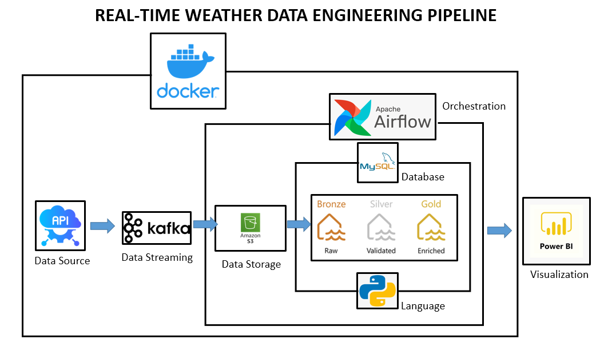
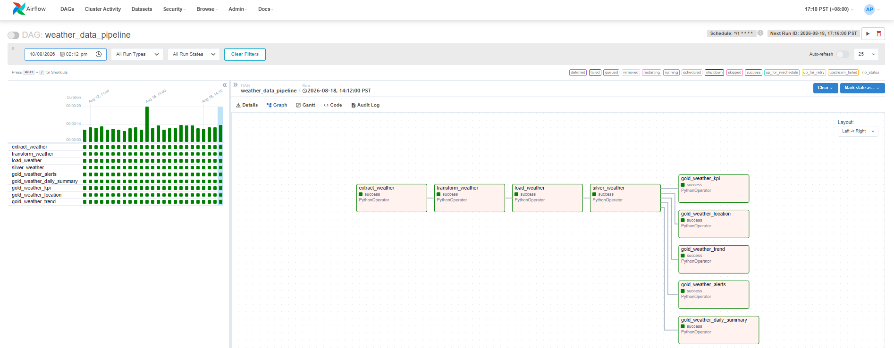
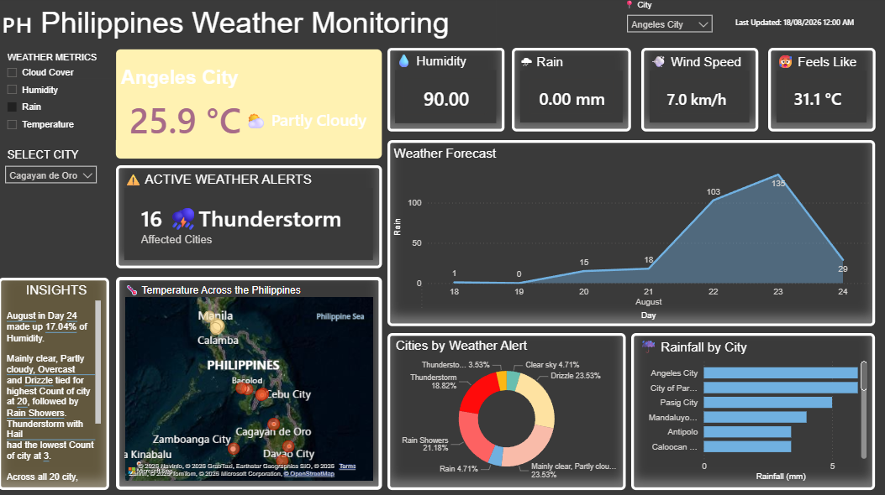

# 🇵🇭 Philippines Real-Time Weather Data Engineering Pipeline

<p align="center">
  
</p>

## 📖 Project Overview

This project is an end-to-end **real-time weather data engineering pipeline** that collects weather data from locations across the Philippines using the **Open-Meteo API**, streams the data through **Apache Kafka**, stores raw data in **MinIO**, processes it using **Apache Airflow**, and loads transformed data into **MySQL** for analysis and visualization in **Power BI**.

The pipeline follows a layered data architecture:

**Bronze → Silver → Gold**

This project demonstrates real-world data engineering concepts including:

* Real-time API ingestion
* Event streaming with Apache Kafka
* Object storage using MinIO
* ETL orchestration with Apache Airflow
* SQL-based data transformation
* Data warehousing
* Docker containerization
* Power BI dashboard development

---

# 🚀 Technologies Used

| Category               | Technology     |
| ---------------------- | -------------- |
| Programming Language   | Python         |
| Weather API            | Open-Meteo API |
| Message Broker         | Apache Kafka   |
| Kafka Monitoring       | Kafdrop        |
| Workflow Orchestration | Apache Airflow |
| Object Storage         | MinIO          |
| Database               | MySQL          |
| Containerization       | Docker         |
| Dashboard              | Power BI       |
| Query Language         | MySQL SQL      |
| Data Format            | JSON / CSV     |

---

# 🏗️ Architecture

<p align="center">
  
</p>

### Data Flow

```text
Open-Meteo API
      │
      ▼
Python Producer
      │
      ▼
Apache Kafka
      │
      ▼
Python Consumer
      │
      ▼
MinIO - Bronze Layer
      │
      ▼
Apache Airflow
      │
      ▼
MySQL - Silver Layer
      │
      ▼
SQL Transformations
      │
      ▼
MySQL - Gold Layer
      │
      ▼
Power BI Dashboard
```

---

# 📂 Project Structure

```text
real-time-weather-philippines-update/
│
├── README.md
├── requirements.txt
├── .gitignore
│
├── data/
│   └── ph.csv
│
├── images/
│   ├── architecture.png
│   ├── kafdrop.png
│   ├── minio.png
│   ├── weather_dashboard.png
│   └── weather_data_pipeline.png
│
├── producer/
│   └── producer.py
│
├── consumer/
│   └── consumer.py
│
└── infra/
    │
    ├── dags/
    │
    ├── sql/
    │   ├── silver/
    │   └── gold/
    │
    ├── docker-compose.yml
    └── requirements.txt
```

---

# ⚙️ Data Pipeline

## 1. 🌦️ Weather Data Producer

The Python producer retrieves weather information from the **Open-Meteo API** for multiple locations across the Philippines.

The list of locations is stored in:

```text
data/ph.csv
```

The producer retrieves weather information such as:

* 🌡️ Temperature
* 🌡️ Apparent Temperature
* 💧 Humidity
* 🌧️ Rain
* 💨 Wind Speed
* ☀️ Weather Conditions
* 🕐 Weather Time

The collected weather data is published to an **Apache Kafka** topic.

---

# 2. 📨 Apache Kafka

Apache Kafka acts as the real-time messaging layer between the weather API producer and consumer.

```text
Open-Meteo API
      │
      ▼
Python Producer
      │
      ▼
Kafka Topic
      │
      ▼
Python Consumer
```

Kafka allows weather data to be continuously streamed while keeping the producer and consumer independent from each other.

---

# 3. 📥 Python Consumer

The Python consumer reads weather messages from Kafka and stores the raw JSON data in **MinIO**.

This represents the **Bronze Layer** of the data architecture.

```text
Kafka
  │
  ▼
Python Consumer
  │
  ▼
MinIO
  │
  └── Bronze Layer
```

Raw data is preserved in JSON format before being processed by the ETL pipeline.

---

# 🗄️ Data Lake Architecture

## 🥉 Bronze Layer

The Bronze Layer contains the raw weather data collected from the Open-Meteo API.

| Attribute | Description                |
| --------- | -------------------------- |
| Storage   | MinIO                      |
| Format    | JSON                       |
| Data Type | Raw                        |
| Purpose   | Preserve original API data |

```text
Open-Meteo API
      │
      ▼
Apache Kafka
      │
      ▼
Python Consumer
      │
      ▼
MinIO
      │
      └── Bronze Layer
```

---

## 🥈 Silver Layer

Apache Airflow extracts the raw JSON data from MinIO, transforms the data, and loads the cleaned records into MySQL.

```text
MinIO
  │
  ▼
Extract
  │
  ▼
Transform
  │
  ▼
Load
  │
  ▼
MySQL
  │
  └── Silver Layer
```

The Silver Layer contains cleaned and structured weather observations.

---

## 🥇 Gold Layer

The Gold Layer contains analytics-ready datasets created from the Silver Layer using SQL transformations.

### 📊 GOLD_WEATHER_KPI

Contains the latest weather information for each city.

**Key fields:**

* City
* Temperature
* Feels Like
* Humidity
* Rain
* Wind Speed
* Weather Status
* Last Updated

### 📅 GOLD_WEATHER_DAILY_SUMMARY

Contains aggregated daily weather information.

**Examples:**

* Daily Average Temperature
* Average Humidity
* Total Rain
* Average Wind Speed

### 📈 GOLD_WEATHER_TREND

Contains historical weather observations used for weather trend analysis.

---

# 🔄 Apache Airflow ETL

<p align="center">
  
</p>

Apache Airflow orchestrates the ETL process and automates the movement of weather data between the Bronze, Silver, and Gold layers.

### ETL Process

```text
MinIO
  │
  ▼
Extract Raw Weather Data
  │
  ▼
Transform / Clean Data
  │
  ▼
Load to MySQL Silver
  │
  ▼
SQL Transformations
  │
  ▼
MySQL Gold Tables
```

---

# 📊 Power BI Dashboard

<p align="center">
  
</p>

The processed Gold Layer data is connected to **Power BI** to create an interactive weather monitoring dashboard.

### Dashboard Features

* 🌡️ Current Temperature
* 🌡️ Feels-Like Temperature
* 💧 Humidity
* 🌧️ Rain
* 💨 Wind Speed
* 🗺️ Weather Map
* 📈 Weather Trends
* 🚨 Weather Alerts
* 📊 Daily Weather Summary
* 🏙️ City-Level Filtering
* 🕐 Latest Weather Update

---

# 🖥️ Infrastructure

The pipeline is containerized using **Docker**.

```text
Docker
│
├── Apache Kafka
├── Zookeeper
├── Kafdrop
├── MinIO
├── Apache Airflow
└── MySQL
```

---

# 👨‍💻 Author

**Allen Martinez Picazo**

Data Analyst | Data Engineer

GitHub:
https://github.com/allenMP-DA
