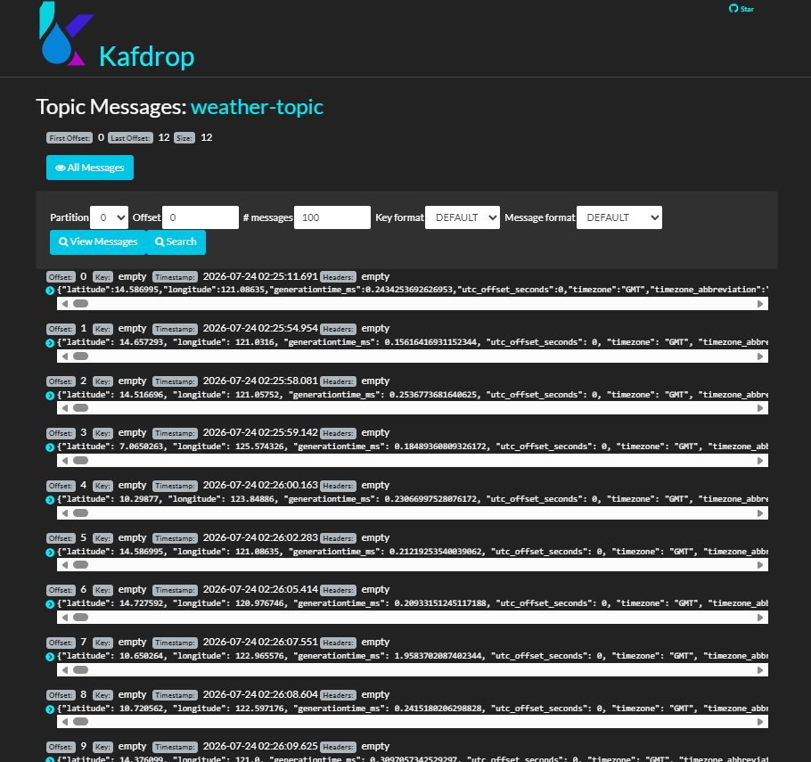
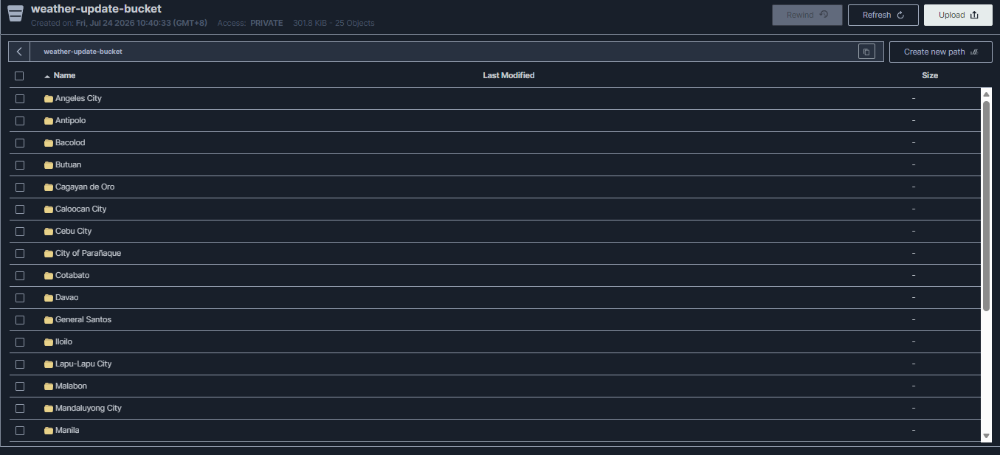

# 🇵🇭 Philippines Real-Time Weather Data Engineering Pipeline

<p align="center">
  
</p>

## 📖 Project Overview

This project is an end-to-end **real-time weather data engineering pipeline** that collects weather data from locations across the Philippines using the **Open-Meteo API**, streams the data through **Apache Kafka**, stores raw data in **MinIO**, processes it using **Apache Airflow**, and loads transformed data into **MySQL** for analysis and visualization in **Power BI**.

The pipeline follows a layered data architecture:

**Bronze → Silver → Gold**

This project demonstrates real-world data engineering concepts including:

* Real-time API ingestion
* Event streaming with Apache Kafka
* Object storage using MinIO
* ETL orchestration with Apache Airflow
* SQL-based data transformation
* Data warehousing
* Docker containerization
* Power BI dashboard development

---

# 🚀 Technologies Used

| Category               | Technology     |
| ---------------------- | -------------- |
| Programming Language   | Python         |
| Weather API            | Open-Meteo API |
| Message Broker         | Apache Kafka   |
| Kafka Monitoring       | Kafdrop        |
| Workflow Orchestration | Apache Airflow |
| Object Storage         | MinIO          |
| Database               | MySQL          |
| Containerization       | Docker         |
| Dashboard              | Power BI       |
| Query Language         | MySQL SQL      |
| Data Format            | JSON / CSV     |

---

# 🏗️ Architecture

<p align="center">
  
</p>

### Data Flow

```text
┌─────────────────────┐
│   Open-Meteo API    │
│    Weather Data     │
└──────────┬──────────┘
           │
           ▼
┌─────────────────────┐
│   Python Producer   │
└──────────┬──────────┘
           │
           ▼
┌─────────────────────┐
│   Apache Kafka      │
│    Weather Topic    │
└──────────┬──────────┘
           │
           ▼
┌─────────────────────┐
│   Python Consumer   │
└──────────┬──────────┘
           │
           ▼
┌─────────────────────┐
│       MinIO         │
│   Bronze Layer      │
│      Raw JSON       │
└──────────┬──────────┘
           │
           ▼
┌─────────────────────┐
│   Apache Airflow    │
│   ETL Orchestration │
└──────────┬──────────┘
           │
           ▼
┌─────────────────────┐
│       MySQL         │
│   Silver Layer      │
└──────────┬──────────┘
           │
           │ SQL Transformations
           ▼
┌─────────────────────┐
│       MySQL         │
│    Gold Layer       │
└──────────┬──────────┘
           │
           ▼
┌─────────────────────┐
│     Power BI        │
│ Weather Dashboard   │
└─────────────────────┘
```

---

# 📂 Project Structure

```text
real-time-weather-philippines-update/
│
├── README.md
├── requirements.txt
├── .gitignore
│
├── data/
│   └── ph.csv
│
├── images/
│   ├── architecture.png
│   ├── kafdrop.png
│   ├── minio.png
│   ├── weather_dashboard.png
│   └── weather_data_pipeline.png
│
├── producer/
│   └── producer.py
│
├── consumer/
│   └── consumer.py
│
└── infra/
    │
    ├── dags/
    │   └── weather_pipeline.py
    │
    ├── sql/
    │   │
    │   ├── silver/
    │   │   └── weather_silver.sql
    │   │
    │   └── gold/
    │       ├── weather_kpi.sql
    │       ├── weather_daily_summary.sql
    │       └── weather_trend.sql
    │
    ├── docker-compose.yml
    └── requirements.txt
```

> **Note:** If your actual DAG or SQL filenames are different, replace the example filenames above with your real filenames.

---

# ⚙️ Data Pipeline

## 1. 🌦️ Weather Data Producer

The Python producer retrieves weather information from the **Open-Meteo API** for multiple locations across the Philippines.

The list of locations is stored in:

```text
data/ph.csv
```

The producer retrieves weather information such as:

* 🌡️ Temperature
* 🌡️ Apparent Temperature
* 💧 Humidity
* 🌧️ Rain
* 💨 Wind Speed
* ☀️ Weather Conditions
* 🕐 Weather Time

The collected weather data is published to an **Apache Kafka** topic.

### Producer Flow

```text
Open-Meteo API
      │
      ▼
Python Producer
      │
      ▼
Apache Kafka
```

---

# 2. 📨 Apache Kafka

**Apache Kafka** acts as the real-time messaging layer between the weather API producer and consumer.

```text
Open-Meteo API
      │
      ▼
Python Producer
      │
      ▼
Kafka Topic
      │
      ▼
Python Consumer
```

Kafka allows weather data to be continuously streamed while keeping the producer and consumer independent from each other.

---

# 3. 📥 Python Consumer

The Python consumer reads weather messages from Kafka and stores the raw JSON data in **MinIO**.

This represents the **Bronze Layer** of the data architecture.

```text
Apache Kafka
      │
      ▼
Python Consumer
      │
      ▼
MinIO
      │
      └── Bronze Layer
```

Raw weather data is preserved in JSON format before being processed by the ETL pipeline.

---

# 🗄️ Data Lake Architecture

## 🥉 Bronze Layer

The Bronze Layer contains the **raw weather data** collected from the Open-Meteo API.

| Attribute | Description                |
| --------- | -------------------------- |
| Storage   | MinIO                      |
| Format    | JSON                       |
| Data Type | Raw                        |
| Purpose   | Preserve original API data |

### Bronze Flow

```text
Open-Meteo API
      │
      ▼
Apache Kafka
      │
      ▼
Python Consumer
      │
      ▼
MinIO
      │
      └── Bronze Layer
```

The Bronze Layer preserves the original data before transformation.

---

# 🥈 Silver Layer

Apache Airflow extracts the raw JSON data from MinIO, transforms the data, and loads the cleaned records into MySQL.

### ETL Flow

```text
MinIO
  │
  ▼
Extract
  │
  ▼
Transform
  │
  ▼
Load
  │
  ▼
MySQL
  │
  └── Silver Layer
```

The Silver Layer contains **cleaned and structured weather observations** that are ready for further transformation.

---

# 🥇 Gold Layer

The Gold Layer contains **analytics-ready datasets** created from the Silver Layer using SQL transformations.

## 📊 GOLD_WEATHER_KPI

Contains the latest weather information for each city.

### Key Fields

* City
* Temperature
* Feels Like
* Humidity
* Rain
* Wind Speed
* Weather Status
* Last Updated

---

## 📅 GOLD_WEATHER_DAILY_SUMMARY

Contains aggregated daily weather information.

### Examples

* Daily Average Temperature
* Average Humidity
* Total Rain
* Average Wind Speed

---

## 📈 GOLD_WEATHER_TREND

Contains historical weather observations used for weather trend analysis.

The table can be used to analyze changes in:

* Temperature
* Humidity
* Rainfall
* Wind Speed
* Weather Conditions

---

# 🔄 Apache Airflow ETL

<p align="center">
  
</p>

Apache Airflow orchestrates the ETL process and automates the movement of weather data between the Bronze, Silver, and Gold layers.

### ETL Process

```text
┌─────────────────────┐
│       MinIO         │
│   Bronze Layer      │
└──────────┬──────────┘
           │
           ▼
┌─────────────────────┐
│      Extract        │
│   Raw Weather Data  │
└──────────┬──────────┘
           │
           ▼
┌─────────────────────┐
│     Transform       │
│   Clean / Structure │
└──────────┬──────────┘
           │
           ▼
┌─────────────────────┐
│        Load         │
│      MySQL          │
│   Silver Layer      │
└──────────┬──────────┘
           │
           ▼
┌─────────────────────┐
│  SQL Transformations│
└──────────┬──────────┘
           │
           ▼
┌─────────────────────┐
│      MySQL          │
│    Gold Layer       │
└─────────────────────┘
```

Airflow is responsible for scheduling and orchestrating the data transformation workflow.

---

# 📊 Power BI Dashboard

<p align="center">
  
</p>

The processed Gold Layer data is connected to **Power BI** to create an interactive weather monitoring dashboard.

## Dashboard Features

| Feature                    | Description                                       |
| -------------------------- | ------------------------------------------------- |
| 🌡️ Current Temperature    | Displays current temperature                      |
| 🌡️ Feels-Like Temperature | Displays apparent temperature                     |
| 💧 Humidity                | Shows current humidity                            |
| 🌧️ Rain                   | Displays rainfall information                     |
| 💨 Wind Speed              | Displays current wind speed                       |
| 🗺️ Weather Map            | Displays weather conditions by location           |
| 📈 Weather Trends          | Shows historical weather changes                  |
| 🚨 Weather Alerts          | Highlights weather conditions requiring attention |
| 📊 Daily Weather Summary   | Shows daily aggregated weather data               |
| 🏙️ City Filtering         | Allows filtering by city                          |
| 🕐 Latest Update           | Shows the latest weather update                   |

The dashboard allows users to monitor weather conditions across different locations in the Philippines.

---

# 🖥️ Infrastructure

The pipeline is containerized using **Docker**.

### Main Infrastructure Components

```text
                    Docker
                       │
       ┌───────────────┼───────────────┐
       │               │               │
       ▼               ▼               ▼
   Apache Kafka     Zookeeper       Kafdrop
       │
       │
       ├───────────────┐
       │               │
       ▼               ▼
     MinIO         Apache Airflow
                       │
                       ▼
                     MySQL
```

### Infrastructure Roles

| Component      | Purpose                        |
| -------------- | ------------------------------ |
| Docker         | Containerization               |
| Apache Kafka   | Real-time message streaming    |
| Zookeeper      | Kafka coordination             |
| Kafdrop        | Kafka monitoring               |
| MinIO          | Object storage / Bronze Layer  |
| Apache Airflow | ETL orchestration              |
| MySQL          | Silver and Gold data warehouse |

---

# 🔁 End-to-End Pipeline

The complete pipeline can be summarized as:

```text
                 ┌──────────────────┐
                 │  Open-Meteo API  │
                 └────────┬─────────┘
                          │
                          ▼
                 ┌──────────────────┐
                 │ Python Producer  │
                 └────────┬─────────┘
                          │
                          ▼
                 ┌──────────────────┐
                 │  Apache Kafka    │
                 └────────┬─────────┘
                          │
                          ▼
                 ┌──────────────────┐
                 │ Python Consumer  │
                 └────────┬─────────┘
                          │
                          ▼
                 ┌──────────────────┐
                 │      MinIO       │
                 │  Bronze Layer    │
                 └────────┬─────────┘
                          │
                          ▼
                 ┌──────────────────┐
                 │  Apache Airflow  │
                 │       ETL        │
                 └────────┬─────────┘
                          │
                          ▼
                 ┌──────────────────┐
                 │      MySQL       │
                 │  Silver Layer    │
                 └────────┬─────────┘
                          │
                          ▼
                 ┌──────────────────┐
                 │ SQL Transform    │
                 └────────┬─────────┘
                          │
                          ▼
                 ┌──────────────────┐
                 │      MySQL       │
                 │   Gold Layer     │
                 └────────┬─────────┘
                          │
                          ▼
                 ┌──────────────────┐
                 │     Power BI     │
                 │    Dashboard     │
                 └──────────────────┘
```

---

# 📸 Screenshots

## Kafka Monitoring

<p align="center">
  
</p>

## MinIO Bronze Layer

<p align="center">
  
</p>

## Airflow Pipeline

<p align="center">
  
</p>

## Power BI Dashboard

<p align="center">
  
</p>

---

# 🎯 Project Objectives

This project was developed to demonstrate practical experience with:

* Building real-time data pipelines
* Working with REST APIs
* Streaming data using Apache Kafka
* Implementing a Bronze/Silver/Gold architecture
* Using object storage with MinIO
* Building ETL workflows with Apache Airflow
* Performing SQL transformations
* Designing analytical datasets
* Building interactive Power BI dashboards
* Containerizing data infrastructure with Docker

---

# 🧠 Key Data Engineering Concepts

### Real-Time Data Ingestion

Weather data is continuously retrieved from the Open-Meteo API and published to Kafka.

### Event Streaming

Kafka provides a reliable messaging layer between data producers and consumers.

### Data Lake Architecture

The pipeline separates data into:

```text
Bronze → Raw Data
Silver → Cleaned Data
Gold   → Analytics Data
```

### ETL Orchestration

Airflow automates and schedules the data transformation workflow.

### Analytics

The Gold Layer provides optimized datasets for Power BI reporting and visualization.

---

# 👨‍💻 Author

**Allen Martinez Picazo**

Data Analyst | Data Engineer

GitHub:

https://github.com/allenMP-DA
# Data-Engineering-Philippines-Weather-real-time-data-

